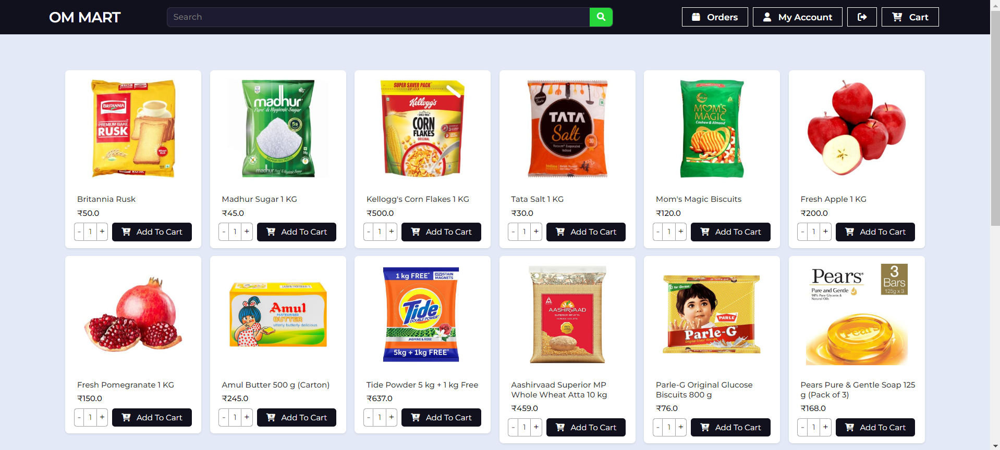
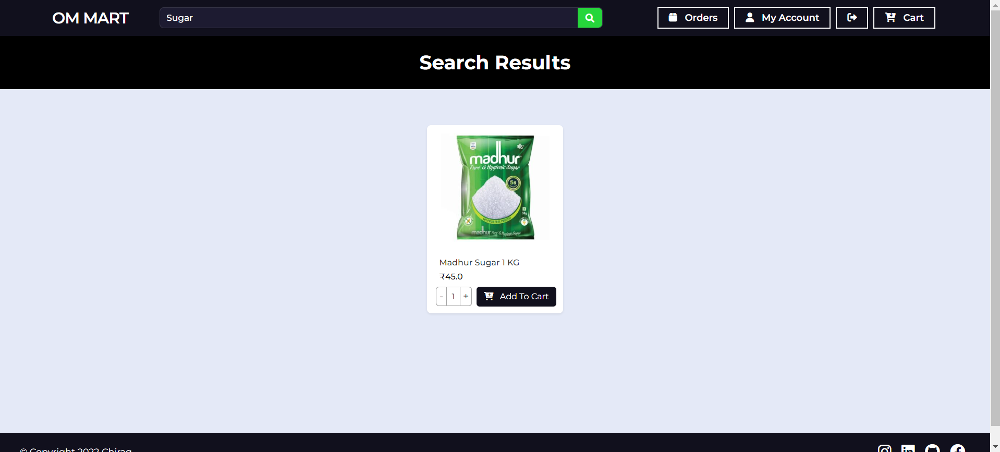
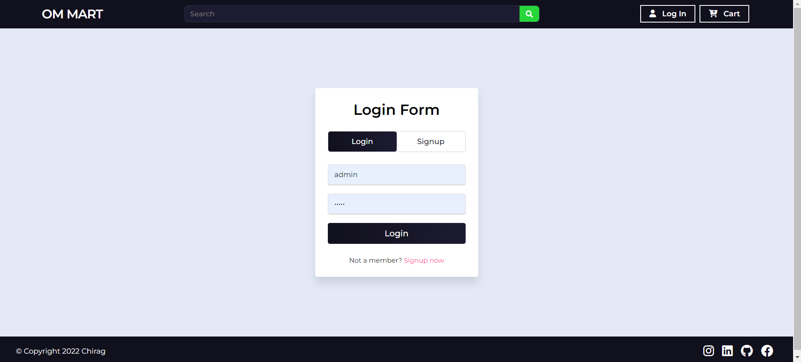
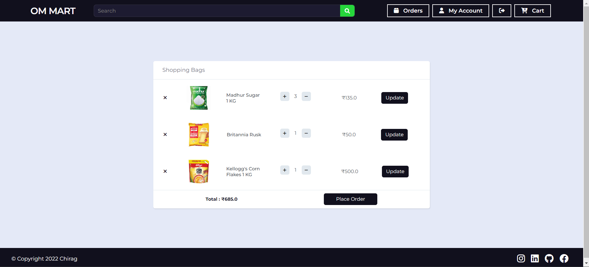
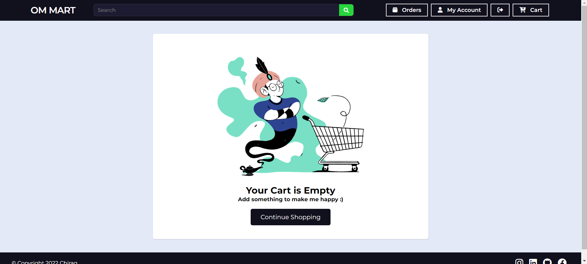
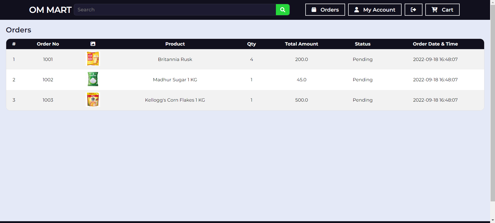
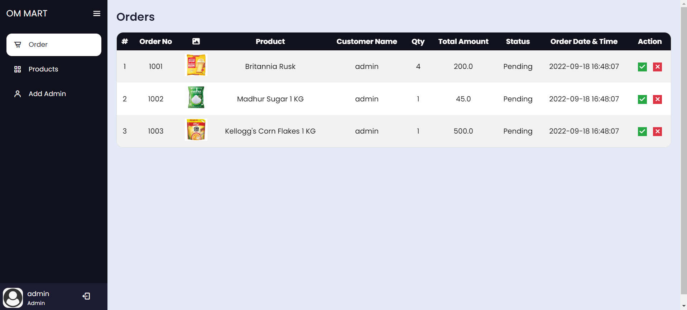
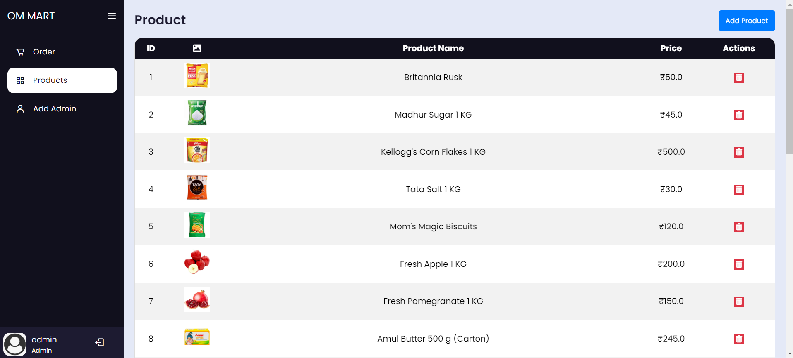
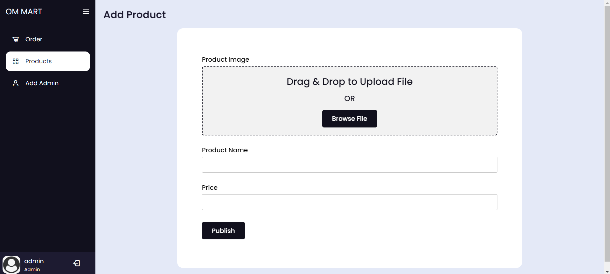

# E-commerce Application

This e-commerce web application is built using Java, JSP, and Servlets with Eclipse IDE and runs on Tomcat 9. The application features both user and admin sides, providing a comprehensive online shopping experience and robust administrative functionalities.

## Tech Stack

The application is built using the following technologies:

- Java
- JSP (JavaServer Pages)
- Servlets
- Bootstrap
- MySQL
- Commons FileUpload
- Commons IO
- COS
- javax.servlet-3.1.1
- HTML
- CSS
- Tomcat 9
- SweetAlert

## Features

### User Side

- **Home Page**: Includes a navbar with a search bar, a footer, and a product grid.
  

- **Search Page**: Displays search results.
  

- **Login/Register Page**: Allows users to log in or register.
  

- **Cart Page**: Shows items in the user's cart.
  

- **Empty Cart Page**: Displays when the cart is empty.
  

- **Orders Page**: Displays all orders with their status.
  

### Admin Side

- **Admin Panel Orders Page**: Shows all orders, with the ability to change the status to delivered, canceled, or pending.
  

- **Products Page**: Admin can add or delete products, with a drag-and-drop image upload feature.
  

- **Add Admin Page**: Allows the admin to add new admins.
  

- **Add Product Page**: Allows the admin to add new products with image upload.
  

## Database Schema

### Database Creation

```sql
CREATE DATABASE ommart;

USE ommart;
```

### Tables

#### User Table

```sql
CREATE TABLE user (
    id INT PRIMARY KEY AUTO_INCREMENT,
    uname VARCHAR(50) NOT NULL,
    password VARCHAR(50) NOT NULL,
    role VARCHAR(20) NOT NULL
);
```

#### Product Table

```sql
CREATE TABLE product (
    id INT PRIMARY KEY AUTO_INCREMENT,
    pimgname VARCHAR(250) NOT NULL,
    pname VARCHAR(250) NOT NULL,
    price FLOAT(10,2) NOT NULL
);
```

#### Cart Table

```sql
CREATE TABLE tblcart (
    id BIGINT(20) NOT NULL AUTO_INCREMENT,
    quantity INT(11) NOT NULL,
    total_price VARCHAR(200) DEFAULT NULL,
    customer_id BIGINT(20) NOT NULL,
    product_id INT NOT NULL,
    mrp_price VARCHAR(200) DEFAULT NULL,
    PRIMARY KEY (id),
    FOREIGN KEY (product_id) REFERENCES product(id)
);
```

#### Orders Table

```sql
CREATE TABLE tblorders (
    id INT(11) NOT NULL AUTO_INCREMENT,
    order_no INT(11) DEFAULT NULL,
    customer_name VARCHAR(200) DEFAULT NULL,
    product_name VARCHAR(400) DEFAULT NULL,
    quantity INT(11) DEFAULT NULL,
    product_price VARCHAR(100) DEFAULT NULL,
    product_total_price VARCHAR(100) DEFAULT NULL,
    order_status VARCHAR(100) DEFAULT NULL,
    image VARCHAR(200) DEFAULT NULL,
    order_date TIMESTAMP NULL DEFAULT CURRENT_TIMESTAMP,
    PRIMARY KEY (id)
);
```

### Initial Data

```sql
INSERT INTO user (uname, password, role) VALUES ('admin', 'admin', 'admin');
```

## Setup

### Prerequisites

- Eclipse IDE
- Tomcat 9
- MySQL (XAMPP or any other MySQL server)

### Steps to Run

1. **Clone the repository**:

   ```bash
   git clone https://github.com/chiragpgauswami/ecommerce-app.git
   ```

2. **Import the Database**:

   Import the `ommart.sql` file into your MySQL database with the database name `ommart`. you can find the file in the `db` folder.

3. **Open the Project**:

   Open the project in Eclipse IDE.

4. **Configure Tomcat 9**:

   Set up Tomcat 9 in Eclipse and run the application.

### Login Credentials

- **Username**: admin
- **Password**: admin

## Customization

You can customize the application by modifying the JSP, Java, and CSS files. Feel free to experiment with different styles and functionalities.

## Contributing

Contributions are welcome! If you find any issues or want to add new features, please open an issue or submit a pull request.

## Author

This project was created by Chirag P. Gauswami.

## License

This project is open source and available for use.

## Links

- [Source Code](https://github.com/chiragpgauswami/ecommerce-app.git)
